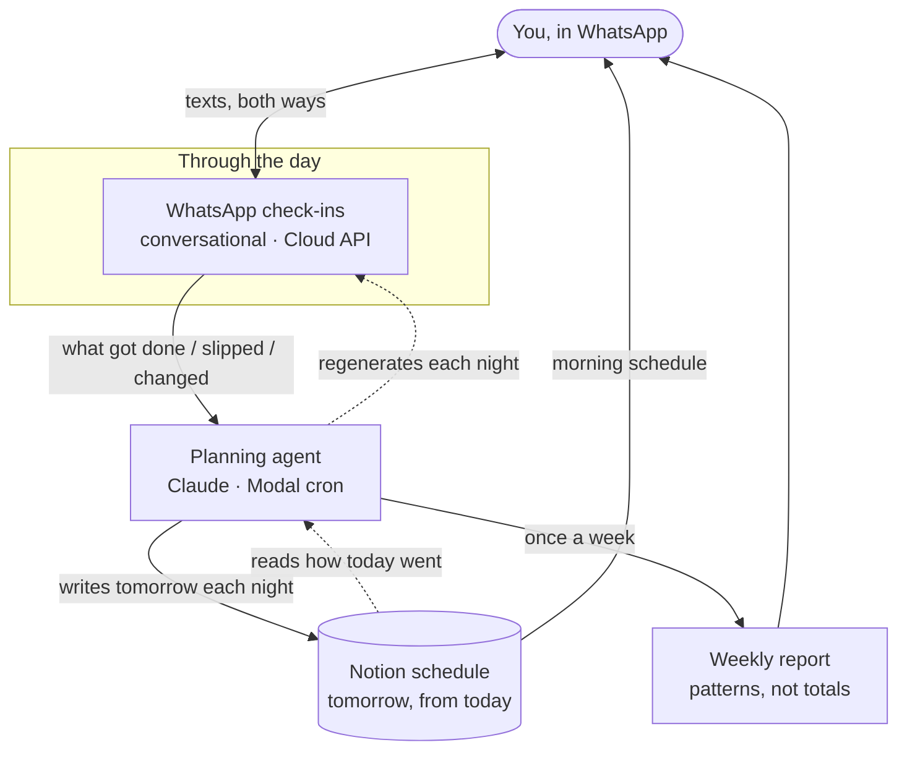

# WhatsApp Day Planner

A personal planning agent that lives in WhatsApp. There is no app to open. It
checks in through the day over WhatsApp, builds tomorrow's schedule every night
into Notion from how today actually went, and once a week sends a short report
built to surface recurring patterns — the time sinks — not totals.

Planning comes to you in your messages, and it adapts mid-day. Tell it a block
slipped, or that something changed, and it renegotiates the plan with you.



## How it works

Three moving parts, deliberately kept apart.

1. **WhatsApp check-ins (through the day).** At the transitions in your schedule
   — just before a focus block, just after one ends, deep inside a long one, and
   a wind-down before bed — the planner texts you. The messages are written to
   read like a person, not a form (see the tone note below). You reply in plain
   language: "did the deep work, skipped the gym, ran long on the call." No
   command syntax, no prefix. It can also renegotiate: "move writing to tonight"
   and it adjusts.

2. **The planning agent (Claude on Modal cron).** Scheduled jobs on
   [Modal](https://modal.com) are the heartbeat. A job every fifteen minutes
   decides which check-in, if any, is due right now (a small deterministic
   policy — no model call). When you reply, Claude interprets the free text into
   a structured outcome and updates Notion. Every night, Claude reconciles the
   weekly template with how today actually went and writes tomorrow's plan.

3. **The Notion schedule (tomorrow, from today).** One row per time block:
   task, time range, category, date, status. The nightly pass reads today's
   outcomes, protects your fixed commitments, offers a slipped high-value block a
   slot if there's room, and writes a plan you can actually follow.

4. **The weekly report (patterns, not totals).** Once a week the agent looks
   back over seven days of planned-vs-actual and writes a short reflection: the
   recurring time sink, the quiet win, and one small change worth trying. It is
   told, explicitly, not to hand you a completion percentage — totals don't
   change behaviour.

## The tone-rules design note

The single most important design decision is that the check-ins read like a
thoughtful friend texting you, not an app. That is not an accident of prompting
scattered through the code — it is one set of **tone rules** kept in
[`planner/prompts.py`](planner/prompts.py) and shared by every prompt: the
check-in interpreter, the nightly scheduler, and the weekly report all inherit
the same voice.

The rules are strict on purpose: one thought per message, react to what was
actually said before moving on, never guilt-trip a missed block, treat
renegotiating the plan as normal rather than a failure. Because they live in one
place, the voice can be tuned without touching any messaging or scheduling
logic. This separation — voice as data, behaviour as code — is what keeps the
product feeling human as it grows.

## Tech stack

| Layer | Choice | Why |
|---|---|---|
| Planning agent | **Claude** (`claude-opus-4-8`) via the Anthropic SDK | Interprets free-text replies and builds schedules; structured outputs guarantee parseable results |
| Scheduling / runtime | **Modal** cron functions | Serverless scheduled jobs — no server to keep alive; the fifteen-minute heartbeat and nightly/weekly passes |
| Messaging | **WhatsApp Cloud API** (Meta Graph API) | Send and receive over the number people already use; no new app |
| State of record | **Notion** database | Human-readable schedule you can open and edit; the source of truth |
| Inbound webhook | **FastAPI** (Modal endpoint or standalone) | Verifies the Cloud API handshake and receives messages |

## Project structure

```
whatsapp-day-planner/
├── planner/
│   ├── __init__.py
│   ├── config.py          # settings, all from the environment
│   ├── prompts.py         # system prompts — including the shared tone rules
│   ├── whatsapp.py        # WhatsApp Cloud API client + webhook helpers  (messaging)
│   ├── checkin.py         # conversational check-in engine               (messaging)
│   ├── schedule.py        # nightly schedule generation                  (scheduling policy)
│   ├── report.py          # weekly patterns report
│   ├── notion_store.py    # Notion read/write — the only file that knows the schema
│   └── app.py             # Modal app: cron schedules + inbound webhook endpoint
├── webhook.py             # standalone FastAPI webhook (alternative to the Modal endpoint)
├── requirements.txt
├── .env.example
├── .gitignore
├── LICENSE
└── README.md
```

The split between messaging (`whatsapp.py`, `checkin.py`) and scheduling policy
(`schedule.py`) is intentional: the code that decides *what tomorrow looks like*
never touches the code that decides *what to text you*, and vice-versa. To be
honest about it — they still share `notion_store.py` and the tone rules, which
is the point of keeping those in one place each.

## Setup

You need three accounts: an Anthropic API key, a WhatsApp Cloud API app, and a
Notion integration. Then Modal to run it.

### 1. Install

```bash
git clone https://github.com/hermann-ndamen/whatsapp-day-planner.git
cd whatsapp-day-planner
python -m venv .venv && source .venv/bin/activate
pip install -r requirements.txt
cp .env.example .env      # then fill it in
```

### 2. Notion integration

1. Create an internal integration at
   [notion.so/my-integrations](https://www.notion.so/my-integrations) and copy
   the token into `NOTION_TOKEN`.
2. Create a database with these properties: **Task** (title), **Time**
   (text, `HH:MM-HH:MM`), **Category** (select), **Date** (date), **Status**
   (select: Planned / Done / Partial / Skipped).
3. Share that database with your integration and put its id in
   `NOTION_SCHEDULE_DB`.

### 3. WhatsApp Cloud API

1. In the [Meta developer console](https://developers.facebook.com), add the
   WhatsApp product and copy the access token and phone number id into
   `WHATSAPP_TOKEN` and `WHATSAPP_PHONE_NUMBER_ID`.
2. Invent a random string, put it in `WHATSAPP_VERIFY_TOKEN`, and enter the same
   string in the webhook configuration screen.
3. Set your own number as `WHATSAPP_RECIPIENT` (E.164 digits, no `+`).

### 4. Deploy to Modal

Create a Modal secret from your `.env` so the functions can read it, then
deploy:

```bash
modal secret create day-planner-secrets --from-dotenv .env
modal deploy planner/app.py
```

Modal prints URLs for the two webhook endpoints. Register the one ending in
`whatsapp-webhook` (POST) and `whatsapp-webhook-verify` (GET) in the Meta
webhook configuration, using your `WHATSAPP_VERIFY_TOKEN`.

The cron triggers run in **UTC** — adjust the `modal.Cron(...)` expressions in
[`planner/app.py`](planner/app.py) so the nightly and weekly jobs land at the
local times you want (the in-app scheduling math already uses your
`PLANNER_TIMEZONE`).

### Running the webhook yourself (optional)

If you would rather host the inbound webhook somewhere other than Modal, run the
standalone FastAPI app — it reuses the identical planner logic:

```bash
uvicorn webhook:app --host 0.0.0.0 --port 8000
```

## Security notes

- **No secrets in the repo.** Every credential is read from the environment via
  [`planner/config.py`](planner/config.py). `.env` is git-ignored; only
  `.env.example` with placeholders is committed.
- **On Modal, secrets are injected**, not baked into the image — they live in a
  Modal secret created from your `.env`.
- **Verify-token handshake.** The inbound webhook only echoes Meta's challenge
  when the verify token matches, so a stranger cannot register your endpoint.
- **Fail soft.** The cron jobs and webhook never crash on an API error — they
  log and move on, so one bad Notion or WhatsApp call can't wedge the loop.
- **Least privilege.** The Notion integration only needs access to the one
  schedule database you share with it.

## License

[MIT](LICENSE) © 2026 Hermann Ndamen · [hermannndamen.com](https://www.hermannndamen.com)
